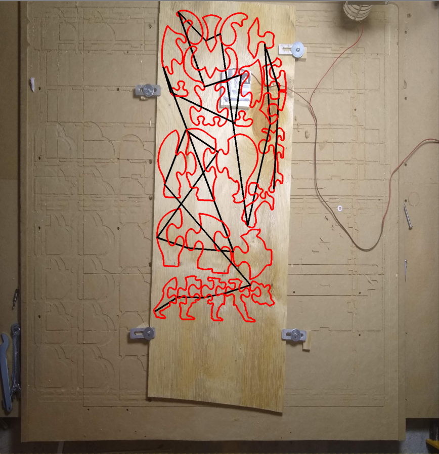

# Overview
This program provides a cut preview of your GCODE, where it will cut, by simply taking a picture of the CNC bed with your wood on bed.
I spend so much time trying to line up the machine with my work piece, making sure it won't intersect my clamps.
Sometimes I hit my clamps, sometimes my bit goes off the workpiece or hits a soft limit, stopping my cut process.

# Caviots

This was thrown together quickly to show the concept.  Amazingly enough it seems to work.
There are many future improvements that could be made with time.

I have 2 children at the moment, so my time is limited, I would love to see someone pick up the concept, roll with it and put it into CNC software.

# Current features (all not pollished out, but mached up):
* Overlay GCODE onto picture from camera
* Can take camera picture at any angle (does not need to be overhead)
* Determines 2D location of every pixel in the image, and displays that location in inches when you click there
* Allows you to move GCODE and rotate GCODE to desired cut location
* Can import SVGCODE and will cut SVG paths at specified depth per pass, cut rate, etc
   * ALlows quick and easy cutting of SVGs from boxespy website
   * Auto adds tabs to SVG (rough, slow, needs work, but mostly works)
* Auto finds probe plate, and probes, XYZ location of the probe plate

# Desired future features (Possible, just needs work, some are easier than others):
* Polish this out, put it into actual CNC software
* Implmenet in different language other than python, as python is not as responsive for this application
* Make UI much better, right not it is very rough
* Make it so webcam is a live view of CNC bed rather than one time picture
* Refactor code and make cleaner.  I threw this together in spare time I had
* Allow 3d rotating view to see Z height, and prevent things like first move being rapid traverse into your work piece
* Camera calibration
* Further evaluate accuracy, may need to put charuco markers directly on workpiece instead, or put charuco markers all along left and right side of Y axis beam.
* Build in calibration of exact location of charuco markers

# How it works
Open CV (computer vision SW) can detect pixel locations of boxes with tags on them (charuco markers).
I put those markers on the vertical rails on the left and right side of the CNC bed.
I use homography (built into openCV) to then project down to the CNC bed or top of my workpiece, getting those pixel locations on the left and right side of the CNC bed.
With the pixel locations on the left and right side of CNC bed, their physical locations of those, we can determine the phyiscal location of any pixel on the image,
and thus we can then overlay a GCODE path and where it will cut in the real world onto the image, getting a cut preview.

